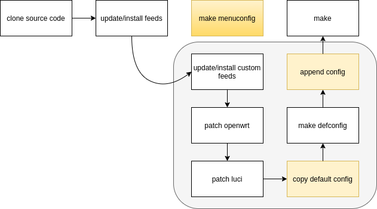

# Slim-Openwrt

> 给小小的Openwrt穿上盔甲

## 特点

* 完全开源
* 基于Openwrt最新稳定版并随之同步更新
* 优化Upnp
* Fullcone NAT (基于[LEAN](!https://github.com/coolsnowwolf/lede))
* 为特别设备设置特别的网关和DNS

## 动机

整个开源社区已经充满了各种各样的Openwrt修改版本，论坛上还有各个玩家自行编译的版本，但是我还是想自己做一个。

国内最流行的Openwrt修改版本应该就是Lean的那一版。Lean的版本确实很符合国情也好用。同时我也发现了一些问题。Lean的分支感觉离官方版本很远了，内核版本已经是5.x，但是软件源版本是18.x，导致很多时候装ipk会报依赖错误。 Lean的版本很多默认配置直接内置在了内部的makefile中，比如一个迅雷加速的东西也会被作为最小安装包被各个版本内置--可能很多人根本用不上吧？ 但是，Lean的固件依然是现在国内最好用的开源Openwrt固件。Lean的改动像是改造出了一个金刚狼——让Openwrt强大好用了好几倍，但是对Openwrt的改动伤筋动骨。

我想实现的是一套盔甲，让Openwrt穿上后可以成为钢铁侠。而且目标是19.07能穿，21.02也能穿，之后22，23也能穿。所有就有了这个项目。

## 实现方法

下图是简单的Openwrt编译过程。


我们努力的方向有两个：

1. 改进默认配置的产生方法。make menuconfig很好用，但是配置不易传播和重复执行，对CI也不友好。
2. 在`make`之前是我们穿戴`盔甲`的时机。


于是我们有了这样的编译流程：



1. 加入自定义的feed，指向本项目的slimapps目录。具体每个app做什么会在其目录下另写文档，在此不再赘述。
2. 对openwrt应用补丁。例如`patches-modules/0001-fullcone-nat/openwrt`
3. 对`luci`进行补丁。
4. 配置每个项目的profile，拷贝到openwrt根目录下之后执行defconfig就会生成相应配置。
5. 配置生成后再额外补充一些内容到.config文件。
6. make，等待之后固件就生出来了。

## 编译方法

```shell
# 如果是编译x86/kvm使用的版本
make SLIM_CFG_PROFILE=slim showtime
# 或者忽略SLIM_CFG_PROFILE,因为默认就是slim这个配置
make showtime
# 如果编译Miwifi版本
make SLIM_CFG_PROFILE=r1cl showtime

# 修改之后重新编译,注意profile参数和之前一致
make SLIM_CFG_PROFILE=slim encore
```